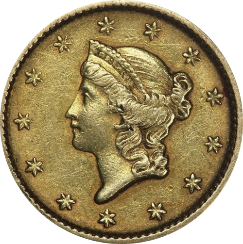

A group of friends and I occasionally like to get together to play Poker. Yet
something keeps happening that I have observed time and again with these kinds
of group gatherings: It is hard to find a suitable date and then on top people
cancel last minute. This is demotivating for other participants, who in turn
also become less committed and this often leads to such groups failing.

Here is one theory of why this happens and how to solve it, explained with
Poker. This article will assume Texas Hold'em Poker, probably the most popular
variant.

tl;dr People's incentives are not aligned. The solution is to create a social
rule that makes folding (canceling attendance) have a bit of negative EV.

## Aside: Poker Basics

You can skip this section if you are familiar with Texas Hold'em Poker.

Poker is played with a standard deck of 52 cards and with 2 to 9 players.

The game is played over many game rounds that are called hands. Unfortunately
hand also refers to the specific cards that a player is holding, which can be a
little confusing.

At the beginning of the hand each player gets two cards that only the player
themself gets to see. These are the pocket cards. For example A♣ and A♦.

Then over the course of several rounds up to a total of 5 cards are added to the
middle of the table, face-up i.e. everyone gets to see them. These are the
community cards. For example 9♦, T♠, A♠, Q♣ and A♥. (**Note:** T stands for 10 so that all ranks can be
written using a single character: 2, 3, 4, 5, 6, 7, 8, 9, T, J, Q, K, A).

<small>Above you see a player holding their pocket cards and in the back the
five community cards on the table.</small>

At the end of the hand during the _showdown_ each player gets to choose 5 total
cards out of the 7 available cards (their two pockets cards plus the five
community cards). All players share the community cards so they can be used
multiple times. For example the player in the example above would choose A♣, A♦, A♠, A♥ and Q♣ for a final hand
combination of four of a kind aces and queen kicker (which is a very strong
hand). The fact that this player used two aces and the queen from the community
cards does NOT prevent other players from using them too.

The strongest hand wins and takes the money in the center of the table (the
pot).

The hands are ranked from the strongest, Royal Flush (e.g. A♦, K♦, Q♦,
J♦ and T♦), all the way to the weakest, High Card (e.g. A♥, 8♠, 5♦,
3♣ and 2♣). Read more about hands rankings
[here](https://www.pokerstars.com/poker/learn/lesson/poker-hand-rankings/).

Of course there are many details missing, in particular during the hand there
are several rounds where players can place bets and raise the bets of other
players. This means that the showdown is not always reached since it can happen
that all players except one _fold_ (give up). Then the only remaining player is
the automatic winner of that hand and takes the pot. Read some more about the
rules [here](https://www.pokerstars.com/poker/games/texas-holdem/) or
[here](https://en.wikipedia.org/wiki/Texas_hold_'em).

A few other concepts that appear in this article:

* Chips: Small disks that represent money. In the image above you can see green,
  white, red and blue chips on the table close to the player. Different colors
  represent different amounts (e.g. green 10 cent, white 50 cent).
* Stack: The chips that are currently yours. In the image above those green,
  white, red and blue chips are this player's stack.
* Pot: The chips in the center of the table where all the bets by the different
  players get added. The winner of a hand takes the pot and adds it to their
  stack. At the very beginning of a hand the pot is usually empty.

## ... Back to the Main Article

Let's assume you are at the beginning of a Poker hand with just one other player
(Victoria) and you just got dealt A♥ and A♠
whereas she got dealt 7♥ and 2♣ (of course, in a real game you do not
know what other players get dealt). No community cards have been uncovered. Who
of you is going to win at showdown? That is impossible to predict, right? Well,
not quite. You cannot make a certain prediction, for example if the community
cards end up being 7♠, 7♣, 2♦, 8♣ and
9♣ then Victoria would win whereas
if the community cards end up being A♦, 3♦,
5♠, 2♥ and K♠
then you would win. Is there _nothing_ you can say about how things might turn
out before seeing the community cards?

Yes you can say something, this is what is known as expected value (EV). What is
EV? Well it is the _value_ you _expect_ to gain (or lose) in a particular
situation. For example let's say I offer you the following bet: I will flip a
fair coin. If it comes up heads I will give you $1,000 and if it
comes up tails you have to give me $10. Would you play?

Think about it for a moment. Would you play and if yes, why? The coin is really
fair (i.e. not a trick coin that always comes up tails).

Probably you would play, but why? After all, you _could_ simply lose
$10, which is not the end of the world but still sucks, right? You
would play because the EV is positive, which you know intuitively even if you
did not calculate it (the exact calculation being: $EV = 0.5\times 1000 -
0.5\times 10 = 495$). You _expect_ (predict) the bet to generate positive
_value_ for you, on average.

Another example, imagine you are applying for a new job. During the interview
for job H at Horrible Inc. you find that the pay is way below market, the tasks
are boring and the colleagues are pretty nasty. Job F at Fantastic Ltd. in turn
pays excellently, the tasks are fascinating and the colleagues are already your
best buddies after two hours. Which of the jobs would you pick? Why? You cannot
predict for _sure_ that at job H you would not meet exactly the person who will
put you on the path to becoming the happiest and most fulfilled you have ever
been. However, the expected value of picking job F is positive (i.e. you predict
it would make you happy) whereas the expected value of picking job H is negative
(i.e. you predict it would make you unhappy), therefore picking job F is the
sensible thing to do.

How about in Poker, why can you say A♥ A♠ are
better pocket cards than 7♥ 2♣? Because on average the player with
A♥ A♠ will win much more often than the player with 7♥ 2♣. If you play A♥ A♠
against 7♥ 2♣, 100 times, A♥ A♠ would
win about 87 times and 7♥ 2♣ would win about 13 times.

Note: In the following paragraphs I'm making the assumption that there are no
blinds in Poker to make a point. If you don't know what blinds are, it's
explained later.

So based only on your pocket cards you can already make a prediction how likely
it is you are going to win. If you get dealt pocket cards that have a low EV,
what is the sensible thing to do? Fold (i.e. give up) and wait for the next
hand. So just fold anything that is not the very strongest pocket cards i.e. AA,
AK or KK. In a table of 9 players everyone that does not have one of those hands
would just fold. In fact, once everyone realizes this is what is going on,
everyone would fold any hand except AA just to be on the safe side, since this
is the one with the highest EV in the entire game.

Even before the community cards were dealt the winner would already be clear and
what is worse, the pot would not even contain any money because nobody would
have bet anything.

That sounds like a truly terrible game!

What could you do to solve this? One of you could say to the other players:
"Come on people, this is boring, we all want to see some action, let's not fold
immediately but play a little!" Everyone would nod dutifully and do as
suggested... right? Problem solved!

Well, not really. Sooner or later one player would figure out that if they fold
their bad hands a little more frequently they would start losing a little less
and then other players would follow their example and everyone would end up
exactly where you started.

This is why Poker has blinds. Blinds are obligatory bets placed at the beginning
of each hand blindly (without seeing their pocket cards) by two of the players.
Which two players rotates every hand.

What is the point of the blinds? It makes the two players who posted the blinds
much more likely to play even with suboptimal pocket cards and it makes other
players more likely to play too because they know the players who posted the
blinds might be playing with suboptimal pocket cards so they can be beaten plus
if other players fold easily then the pot is essentially free money. The entire
game of Poker is only possible because of the blinds.

Sometimes Poker is also played with additional obligatory bets that _all_
players have to post at the beginning of the game called ante. This stimulates
the game even further.

Each player would prefer never having to post blinds or antes. Instead the player
would prefer looking at their own pocket cards and then deciding to either fold
or place a bet. However, this makes the game as a whole collapse and that is why
the added incentive of blinds and antes is needed.

## Returning to Poker nights

... and other similar gatherings. Let's assume everyone who joins generally
enjoys it. At the same time, Poker night is not their highest priority in life.
There are about 56 other things that, given the right circumstances, take
priority over Poker night for each person. Therefore, for each person what
_would be perfect_ is to know that Poker night takes place and that enough other
people participate (because then it's more fun) but that they themself can
decide spontaneously up to the last minute whether they are going to join or
not. This maximizes their EV because they get to choose out of all the options
they have available that evening the one option that suits them the most, which
could be catching up with that other friend they have been wanting to meet for
ages, going to the cinema with their partner, recharging after a long week by
staying home or in fact going to Poker night. The alternatives are all
reasonable things people enjoy doing and it make total sense that they would
sometimes or even always take priority over Poker night. Not to speak of
emergencies and illness. Going to Poker night right after breaking your arm
might be _possible_ but has a very negative EV.

However, how does this impact the other people who want to come to Poker night?
If I predict that everyone else might cancel last minute due to other plans then
I will proactively start making other plans because being stuck with a canceled
event at the last minute or playing Poker with just one or two other people is
not that much fun. If I start making other plans and canceling Poker night
attendance this again negatively impacts the likelihood of other people
attending and so on... it's a vicious cycle.

Everyone maximizes their own EV by committing as late as possible even though
this threatens the evening as a whole, much the same way that Poker as a game
does not work if everyone folds all pocket cards except AA.

So, what is the solution? Create a social rule that makes folding (canceling
attendance) have a little bit of negative EV much like the blinds and antes do
in Poker.

Some examples:

* If someone said they would attend but they do not, they have to buy a round of
  drinks for everyone the next time they come.
* If someone commits to attending they have to transfer the money for the first
  buy-in (or a fraction of it) to the host of the evening. If the participant
  cancels after this, they get no refund and their money gets added to the pot
  in small increments.
* Use social pressure, reputation or shame to make _folding_ expensive.
  Presumably this is what many groups do implicitly without ever consciously
  deciding on it. If your bowling group gives Pedro the cold shoulder after he
  failed to come for the second time, this is what is going on.

Just like in Poker the negative impact should be small. There is a reason why
blinds and antes are small amounts compared to your entire stack. This means
that the Poker players who posted the blinds still have the option of folding if
they get really terrible cards. They are not obligated to play every hand.
Concerning gatherings, it means that if someone has got some other activity they
really want to participate in instead of Poker night, they also have that
option. In both cases they just have to accept the small price of losing the
blind.

I think one of the main reasons why this works in the game of Poker and why I
predict it also works in gatherings is that it creates incentives to behave in a
certain way but much **more importantly** it creates **common knowledge** that
those incentives exist, meaning everyone is able to rely much more on other
people's behavior and due to this fact they themself start behaving in ways that
benefit the game (or group) more. (Common knowledge means all participants know
the rules. It also means that all participants know that all other participants
know the rules. And it also means that all participants know that all other
participants know that all participants know the rules. And so on.)

To re-iterate: The analogy this article is making is that before playing a hand
in Poker if I had the choice I would always look at my pocket cards before
making any bet. I would never voluntarily post blinds or antes. However, this
makes the game not work. In social gatherings it is rational for me to delay my
decision as long as possible without committing because then I get to maximize
my expected value once I know how I am feeling and what options I have
available. This, however, is detrimental to the survival of the group.
Introducing an incentive that encourages committing and disencourages canceling
after having committed could have the same positive effect as blinds and antes do
in Poker, in particular by creating common knowledge about this very fact.

Some alternative solutions:

* Make _folding_ extremely expensive so nobody ever does it. For example a
  college course that ejects students who are absent even once (unless they
  bring a doctor's note).
* Make whathever the group is doing more attractive so that the EV of attending
  increases, thus making attendees less likely to choose another activity. For
  example, if you are organizing talks you can try to get more popular and
  interesting speakers. Artificially limiting the number of available spots
  could be another way of increasing the perceived value of the event.
* Increase the size of the pool of potential attendees. For example assume that
  a group of 7 friends meets for lunch the last Sunday of every month.
  Experience has shown that each of them is 70% likely to attend. This means
  that on average about 5 friends attend each lunch. They would like to have at
  least 6 people. They can achieve this by inviting more people. If N is the
  number of potential participants, $N \times 0.7 \ge 6$ leads us to $N \ge 8.57$ i.e. They
  need to invite at least 9 people total. Note that in reality of course
  different people have different probabilities of attending.

Closing thoughts:

* This is just an idea I came up with. Maybe it's completely wrong, probably
  it's missing some important considerations and probably others came up with
  something very similar before. In particular, the whole thing can also be
  framed as a [stag
  hunt](https://www.lesswrong.com/posts/zp5AEENssb8ZDnoZR/the-schelling-choice-is-rabbit-not-stag).
* Introducing (monetary) _punishments_ (an incentive can easily be understood as
  a punishment) to social relationships can probably do a lot of damage, so be
  careful.
* Talking about EV when meeting friends could be perceived as cold and could
  damage relationships, so again, be careful. Not everyone likes
  thinking and talking explicitly about such things.
* Very few people exclusively maximize their own EV. People are capable and in
  fact do make decisions to benefit a group out of pure altruism.

## Empirical Data

I started a book club in February 2023 and since the beginning I pushed for the
rule that if you don't come, you pay for everyone's drinks next time. The club
has been meeting almost every week for over a year and is growing. I believe
this rule contributed to the success of the group but of course there are too
many factors to know for sure and I am heavily biased. I can think of three
somewhat comparable groups (without such a rule) I attended in the last three
years that fizzled out after 2 months. But again, too many factors to know for
sure.

I would be very interested in hearing other people's experiences or someone
trying a (somewhat) controlled experiment.

## Credits

* Many thanks to Anjali, Bijay, Catarina, Daniel
  ([@7secularsermons](https://sevensecularsermons.org)), Hauke, Nawid and Robert
  for proof reading, criticism and suggestions.
* Image with pocket and community cards:
  * Bob de Becker
  * License CC-BY-2.0
  * https://commons.wikimedia.org/wiki/File:All_in_(23243546592).jpg
* Gold dollar coin
  * (I removed the white background and converted it to webp format)
  * Coin: James B. Longacre. Image by Lost Dutchman Rare Coins
  * License CC BY-SA 3.0 US Deed
  * https://commons.wikimedia.org/wiki/File:1852_gold_dollar_obverse.jpg
