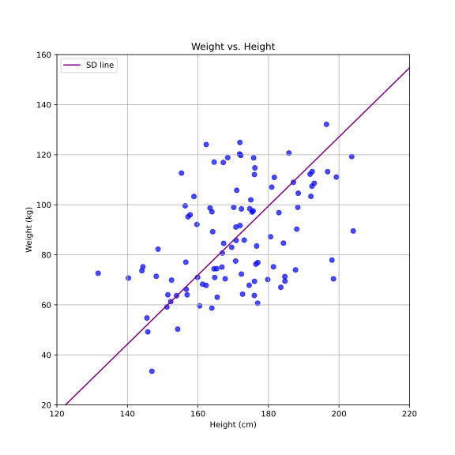

A few days ago I was stumped by a question that came up while studying Chapter
10 "Regression" of _Statistics_ by Freedman, Pisani and Purves.

The context is regression with two variables.

Notation:
* σ (sigma) and SD: standard deviation
* μ (mu): mean
* r: Pearson correlation coefficient
* x and y: the two variables
* $\sigma_x$: standard deviation of x
* $\mu_x$: mean of x

Chapter 8 had introduced the concept of the _SD line_, which is the line that
crosses the point of means $(\mu_x,\mu_y)$ as well as
$(\mu_x+\sigma_x,\mu_y+\sigma_y)$, $(\mu_x-\sigma_x,\mu_y-\sigma_y)$,
$(\mu_x+2\cdot\sigma_x,\mu_y+2\cdot\sigma_y)$ and all other points that are an
equal number of SDs away from the point of means.

For example here is a scatter diagram of ficticious height and weight data with
the _SD line_. For those less familiar with the metric system, the mean
values 171cm and 87kg are about 5ft 7in and 192lb respectively.

Chapter 8 also introduces the correlation coefficient $r$ which measures how
strong the linear association between the variables is. The closer it is to 1
(or -1) the stronger the variables are associated. In Chapter 9 we learn that
the correlation coefficient does not change if we interchange the variables.
That is, weight is as correlated with height as height is with weight.

In our example case $r = 0.462$

In Chapter 10 the idea of the regression line is introduced. The regression
line is a line that best fits the data, minimizing vertical distance to the
points. It allows to predict for each value of x (height) the mean value of
y (weight). The chapter also explains that the slope of the _SD line_ is
$\frac{\sigma_y}{\sigma_x}$ and the slope of the regression line is
$r\frac{\sigma_y}{\sigma_x}$

This green regression line will tell you for each value of x (height) the mean
value of y (weight). If you divide the plot into columns, the regression line
aproximately passes through the mean y (weight) value within each column.

So far so good.

Then, however, we learn that there is a second regression line, namely the one
that for each value of $y$ (weight) predicts the mean value of $x$ (height). That
might sound similar, but is not the same thing. If you divide the plot into
rows, this second regression line will aproximately pass through the mean x
(height) value for each row.

The book gives no further details on how to calculate this second regression
line.  What is its slope? We know that $r$ never changes and that the slope
must depend on $\sigma_x$ and $\sigma_y$ in some way. Therefore, it must be
$r\frac{\sigma_x}{\sigma_y}$, right? We just invert the standard deviations.

Let's plot the result.

It looks off. In the examples in the book both regression lines were
symmetrical with respect to the _SD line_, whereas here the first regression
line is between the second regression line and the _SD line_. Also, the second
regression line is supposed to minimize the horizontal distance to the points.
If you look at the bottom of the graph you can see that the line is far away
from all points. The same is true for the top of the graph.

In the image below I have marked the points that are too far away from the
second (orange) regression line with red circles. Remember that now we are
trying to minimize the HORIZONTAL distance, which I have indicated with the
olive-green colored arrows.

So, what should we change? If we use $r\frac{\sigma_y}{\sigma_x}$ we get the
slope of the first regression line, which can't be right. And we know $r$
cannot change.

This is the mystery I was pondering. What is the slope given the above
constraints?

The solution to the mystery is that the second regression line calculates $x$
with respect to $y$. So the equation is $x = slope \cdot y + intercept$. And
here slope is precisely $r\frac{\sigma_x}{\sigma_y}$. If we re-order the terms
to have $y$ on the left hand as is usual we get $y = \frac{x -
intercept}{slope} = \frac{1}{slope}x - \frac{intercept}{slope}$

And $\frac{1}{slope}$ is the same as $\frac{1}{r} \cdot
\frac{\sigma_y}{\sigma_x}$ so the only thing that changes between the slopes of
the two regression lines is that the first one includes $r$ and the second one
$\frac{1}{r}$ 

We can now plot that line and voilà.

The equation of the _SD line_ is: $y = 1.38\cdot x - 149$

The equation of the first regression line (green) is: $y = 0.638\cdot x - 22$

The equation of the second regression line (orange) is: $y = 2.99\cdot x - 424$

You can verify for yourself that if you multiply $r$ by the slope of the _SD
line_ (1.38) you'll get the slope of the first (green) regression line and if you
multiply $\frac{1}{r}$ by the slope of the _SD line_ you'll get the slope of
the second (orange) regression line.

If we normalize the data (i.e. center on the mean and plot each point as the
number of SDs distance to the mean) then the slope of the _SD line_ will always
be 1, the slope of the first regression line will be $r$ and the slope of the
second regression line $\frac{1}{r}$ (since both SDs are 1 by definition).

")

The equations in the normalized plot are as follows.

_SD line_: $y = x$

First regression line (green): $y = 0.462\cdot x$

Second regression line (orange): $y = 2.165\cdot x$

You can find the Python code used to generate the data and plots on GitHub:
https://gist.github.com/omarkohl/433968aa54d75e34a5c8b5c50a259ed7
