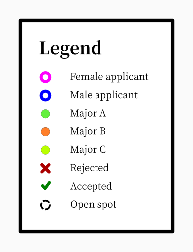
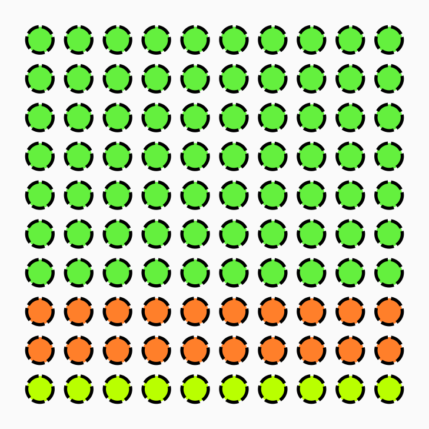
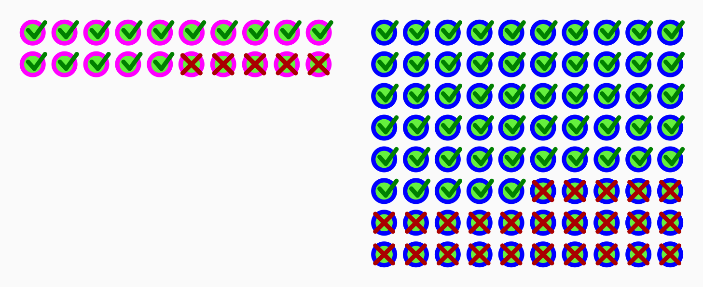
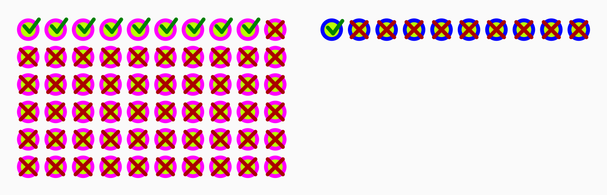

Let's assume _Rivermoor College_ offers 100 open spots for next year.

Let's also assume that 100 women apply ...

... as well as 100 men.

The women and men are equally well qualified. There are also no differences
concerning race, sexual orientation or some other common discrimination
factors.

At the end of the application process the result is that 60 out of 100 men
(i.e. 60%) were accepted to this college but only 40 out of 100 women (40%).
Can we conclude that sex-based discrimination took place?

No matter if your answer is Yes or No, please spend a few minutes thinking
about WHY you could be right or wrong before you continue reading. How sure are
you? Imagine reading the headline: _Study finds "Rivermoor College" accepts 40%
of women and 60% of men_. Would you feel outrage? Would you be convinced from
the beginning that this can't be true?

_Whitespace to encourage you to think..._

 
 
 
 
 
 
 
 
 
 
 
 
 
 
 
 
 
 
 
 
 
 
 
 
 
 
 
 
 
 
 

Below is a legend for how to read all the diagrams in this post.

Let's look more closely what majors this college offers. Namely three different
majors that we'll call A, B and C. The number of spots they offer for different
majors differs, however. 70 spots for major A, 20 spots for major B and 10
spots for major C.

Now let's look at how many women and how many men apply to each major.

Major A (with 70 open spots) gets 20 applications by women and 80 applications
by men.

Major B (with 20 open spots) gets 20 applications by women and 10 applications
by men.

Major C (with 10 open spots) gets 60 applications by women and 10 applications
by men.

As we can see, men and women differ in their preferences.

How are the acceptance rates within the majors?

For major A, 15 out of 20 women get accepted (75%) and 55 out of 80 men (69%).

Therefore, there is in fact discrimination against the men (because they are
less likely to get into the major they applied to, even though there is no
meaningful distinction between them and the women applying).

The same is true for major B. 16 out of 20 women (80%) and 4 out of 10 men
(40%) get accepted.

And for major C. 9 out of 60 women (15%) and 1 out of 10 men (10%) get
accepted.

Below are all the numbers summarized in a table.

<table>
<thead>
    <tr>
        <th>Major</th>
        <th>Open Spots</th>
        <th colspan="3">Women</th>
        <th colspan="3">Men</th>
    </tr>
    <tr>
        <th></th>
        <th></th>
        <th>Applicants</th>
        <th>Accepted</th>
        <th>% Accepted</th>
        <th>Applicants</th>
        <th>Accepted</th>
        <th>% Accepted</th>
    </tr>
</thead>
<tbody>
    <tr>
        <th>A</th>
        <td>70</td>
        <td>20</td>
        <td>15</td>
        <td>75%</td>
        <td>80</td>
        <td>55</td>
        <td>69%</td>
    </tr>
    <tr>
        <th>B</th>
        <td>20</td>
        <td>20</td>
        <td>16</td>
        <td>80%</td>
        <td>10</td>
        <td>4</td>
        <td>40%</td>
    </tr>
    <tr>
        <th>C</th>
        <td>10</td>
        <td>50</td>
        <td>9</td>
        <td>15%</td>
        <td>10</td>
        <td>1</td>
        <td>10%</td>
    </tr>
    <tr>
        <th>Total</th>
        <td>100</td>
        <td>100</td>
        <td>40</td>
        <td>40%</td>
        <td>100</td>
        <td>60</td>
        <td>60%</td>
    </tr>
</tbody>
</table>

This phenomenon is called Simpson's paradox.

> Simpson's paradox is a phenomenon in probability and statistics in which a
> trend appears in several groups of data but disappears or reverses when the
> groups are combined. This result is often encountered in social-science and
> medical-science statistics, and is particularly problematic when frequency
> data are unduly given causal interpretations.

[Wikipedia](https://en.wikipedia.org/wiki/Simpson%27s_paradox)

For any woman it is more likely she will get into the major she wants than for
an equally qualified man and yet overall it looks like women are being
discriminated against. The reason being that the women show a preference for
the majors with fewer spots (i.e.  the ones where it's harder to get into). The
real discriminatory trend against men reverses when combining the groups giving
the impression of discrimination against women.

**Note:** The point of this post is not to claim that everything that looks
like discrimination is in fact a statistical effect or is in fact reverse
discrimination. The reason for choosing a hypothetical example with sexual
discrimination is to make you, the reader, more likely to remember Simpson's
paradox. I suspect that we as humans remember things that cause strong emotions
better, in particular if they look like injustice. The data I use is completely
made up. _Rivermoor College_ does not exist as far as I know and should such a
college exist that is a mere coincidence. I acknowledge that for simplicity
this post assumed two genders but this is not meant to discriminate against
anyone who does not identify with said genders.

**Note:** Were you immediately convinced that the _Rivermoor College_ headline
could only be a lie and are you feeling smug right now? How could a single
headline give you enough information to come to such a strong conclusion? Did
you in fact have multiple hypotheses in mind, one of which should have been
"real discrimination against women is taking place"?

Diagrams created with Inkscape. [Source file](./simpsons_paradox.svg).
